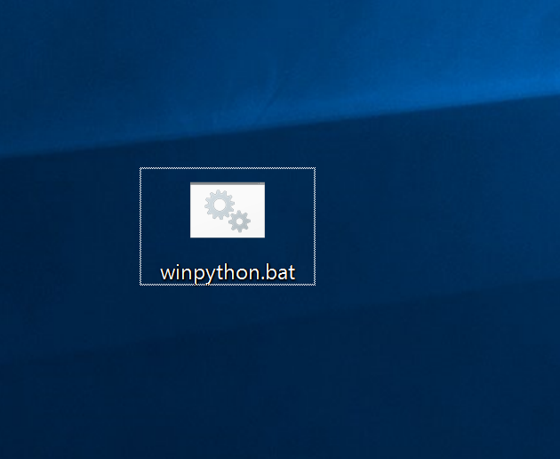
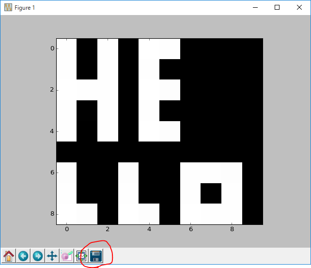
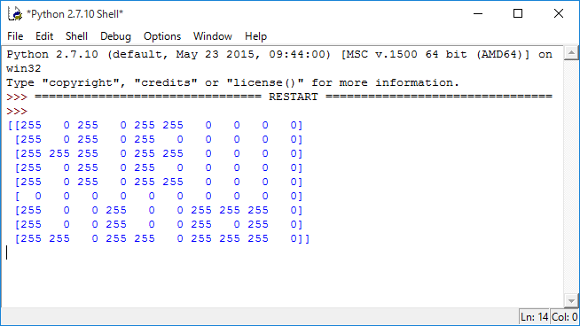
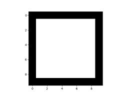
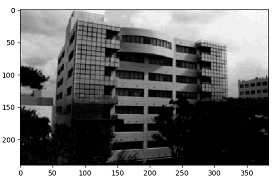

# Image Processing Basics

table of contents

- [Prepare](#Prepare)
- [practice](#practice)
- [How to proceed with the assignment]
- [Round 1: Assignment]
	- [Assignment1. Relationship between pixel values ​​and images]
	- [Assignment2. Relationship between pixel position and image]
	- [Assignment3. Drawing shapes]
	- [Assignment4. filter]
	- [Assignment5. Histogram and Thresholding]
	- [Assignment6. Histogram and Tone Conversion]
- [Round 2：Assignment]
	- [Assignment7. Calculating the area of ​​a shape]
	- [Assignment8. Calculating the length of a shape's contour line]
- [Report]
## preparation

- The experiment uses a programming language called Python. Before starting the experiment, right-click [install.bat](https://github.com/naka-tomo/image_proc_exp/raw/master/Python/install.bat)and select `Save link as` from the menu to save it to your **Desktop**．
Double-click the saved install.bat to run it and install WinPython.
If the installation is successful, **winpython.bat** will be created on your desktop.
- When you download [install.bat](https://github.com/naka-tomo/image_proc_exp/raw/master/Python/install.bat), the file name may be "install.bat.txt". If this happens, change the file name to "install.bat".
- The Python environment will be deleted when you shut down your PC, so please run the installation every time you start your PC.

## practice

For each assignment, you will need to download source code and images, modify the source code, and run it. Please carefully review the steps below, understand what you are doing, and then proceed with the assignment.

1. Right-click on the source code and image below and select `Save link as` from the menu, then save them in the same folder without changing the file name.
 　[source code](https://raw.githubusercontent.com/naka-tomo/image_proc_exp/master/kadai/hello_world.py)
 　[image](https://raw.githubusercontent.com/naka-tomo/image_proc_exp/master/kadai/hello_world.png)

1. Double-click the `winpython.bat` file you downloaded and installed in [preparation](#preparation) to run IDLEX. IDLEX is software for editing and running Python source code. 

1. From IDLEX's `File`→`Open`, open the source code `hello_world.py` downloaded in step 1. The displayed text is the program's source code.  

1. You can run the program by using IDLEX's `Run`&rarr;`Run Module`.  

1. One window displays the processed image. You can save the displayed image by clicking the Save button at the bottom of the window (circled in red in the image).   
The other window displays the contents of variables specified by the *print* function in the program. In this program, the pixel values ​​of the image are displayed. You can save the displayed text by `Select` → `Right-click` → `Copy` and pasting it into Notepad or another program.  

1. Close each window using the X button in the upper right corner. If you do not close the window, an error may occur. If an error occurs, close all windows and start again from step 2.

## How to proceed with the assignment
Download the source code for each assignment, modify it, and complete each assignment. To download, right-click each link and select 'Save Link As' to save the file in the same folder without changing the file name.

Be sure to save the programs you create for each assignment, the images generated, and the text displayed by the print function, and include these in your report, if necessary. In your report, clearly explain and discuss the relationship between the theory (formulas and programs) and the images generated.

To this end, ensure that you obtain sufficient results during the lecture to be able to explain and discuss them in your report.

## Round 1: Assignment

### Assignment1. Relationship between pixel values ​​and images

[source code](https://raw.githubusercontent.com/naka-tomo/image_proc_exp/master/kadai/kadai1.py)

1. Download the program, run it, and read the source code to see what it does.

1. Try changing the assigned value (255 in the original source code) to see the color change.
 
1. In your report, explain the correspondence between these values ​​and the generated image.

### Assignment2. Relationship between pixel position and image

[source code](https://raw.githubusercontent.com/naka-tomo/image_proc_exp/master/kadai/kadai2.py)

1. Download the program, run it, and read the source code to see what it does.

1. Try changing the array index numbers (3 and 7 in the original source code) and see how these numbers correspond to the images.

1. In your report, use the output image to clearly explain the correspondence between the index and the image.

### Assignment3. Drawing shapes

[source code](https://raw.githubusercontent.com/naka-tomo/image_proc_exp/master/kadai/kadai3.py)

1. Download the program, run it, and read the source code to see what it does.

1. Modify the specified part in the source code to generate an image with a white rectangle like the one below. 

1. In your report, please clearly explain the operation of the program you created.

### Assignment4. filter

[source code](https://raw.githubusercontent.com/naka-tomo/image_proc_exp/master/kadai/kadai4.py)

[image](https://raw.githubusercontent.com/naka-tomo/image_proc_exp/master/kadai/kadai4.bmp)

1. Download the source code, run it, and read the source code to see what it does.

1. Modify the program to change the filter values ​​and implement a moving average filter and a Laplacian filter.

1. In your report, please explain the processing of these filters in an easy-to-understand manner by comparing the principles (formulas and source code) with the execution results (printed pixel values).

### Assignment5. Histogram and Thresholding

[source code](https://raw.githubusercontent.com/naka-tomo/image_proc_exp/master/kadai/kadai5.py)

[image](https://raw.githubusercontent.com/naka-tomo/image_proc_exp/master/kadai/kadai5.bmp)

1. Download the source code, run it, and read the source code to see what it does.

1. Run the program and refer to the histogram that is displayed. Modify the program so that it generates a binary image that represents the image's features.

1. In your report, explain what processing is performed by the program you created. Also, use a histogram to clearly explain why you selected the values ​​used in that processing.

### Assignment6. Histogram and Tone Conversion

[source code](https://raw.githubusercontent.com/naka-tomo/image_proc_exp/master/kadai/kadai6.py)

[image](https://raw.githubusercontent.com/naka-tomo/image_proc_exp/master/kadai/kadai6.bmp)

1. Download the source code, run it, and read the source code to see what it does.

1. When you run the program, refer to the histogram that is displayed and generate an image with clearer shading, as shown below. 
 

1. In your report, explain what processing is performed by the program you created. Also, use histograms to clearly explain why you selected the values ​​and expressions used in that processing.

## Round 2: Assignment
- The Python environment will be deleted when you shut down your PC, so after restarting your PC, double-click the install.bat file you downloaded in [Preparation] (#Preparation) to perform the installation.

### Assignment7. Calculating the area of ​​a shape

[source code](https://raw.githubusercontent.com/naka-tomo/image_proc_exp/master/kadai/kadai7.py)

[image](https://raw.githubusercontent.com/naka-tomo/image_proc_exp/master/kadai/kadai7.bmp)

1. Modify the downloaded source code and calculate the area (number of pixels) of each of the six shapes in the image.

1. In your report, please clearly explain what processing is performed by the program you created.

### Assignment8. Calculating the length of a shape's contour line

[source code](https://raw.githubusercontent.com/naka-tomo/image_proc_exp/master/kadai/kadai8.py)

[image](https://raw.githubusercontent.com/naka-tomo/image_proc_exp/master/kadai/kadai8.bmp)

1. Modify the downloaded source code to calculate the contour length of each of the six shapes in the image.

1. In your report, please clearly explain what processing is performed by the program you created.

## Report

The report should include the following:

- **cover**
Please include the title, experimental group, student ID number, name, and experiment date.

- **purpose**
Briefly describe the overall purpose of the experiment.

- **theory**
The theory used in the experiment is explained using mathematical formulas.

